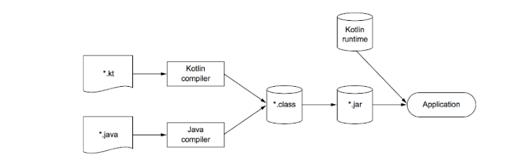

코틀린 왜 필요한가?
-------------

코틀린이란?

> 자바 플랫폼에서 돌아가는 새로운 프로그래밍 언어다.
> 
> 간결하고 실용적이며, 자바 코드와의 상호운용성을 중시한다.
> 
> 함수형 프로그래밍을 지원한다. (JDK 8 이상에서는 뭐 똑같다고 본다.)
> 
> 자바와 동일하게 정적 타입 지정 언어이며, 컴파일 시점에 객체의 필드, 메서드 사용 시 컴파일러가 타입을 검증해준다.
> 
> 정적타입의 장점은
> 
> 성능 : 실행 시점에 어떤 메소드를 호출할지 알아내는 과정이 필요 없으므로 메소드 호출이 빠르다.
> 
> 신뢰성 : 컴파일러가 프로그램의 정확성을 검증하기 때문에 실행 시 프로그램이 오류로 중단될 가능성이 낮다.
> 
> 유지 보수성 : 코드에서 다루는 객체가 어떤 타입에 속하는 지 한 눈에 볼 수 있다.
> 
> 도구 지원 : 정적 타입 지정을 활용하면 더 안전하게 리팩토링이 가능하고, 도구는 더 정확한 코드 완성 기능을 제공한다.
> 
> 
> 예제 소스
> ```kotlin
> data class Person(val name: String, // 데이터 클래스 정의
>                   val age: Int? = null) // 널이 될 수 있는 타입 Int?
> 
> fun main(args: Array<String>) { // 최상위 함수
>   val persons = listOf(Person("예제"),
>                        Person("진원", age = 28)) // 이름 붙인 명시적인 파라미터
> 
>   val oldest = person.maxBy { it.age ?: 0 } // 람다 식과 엘비스 연산자
> } 
> ```
<br/>
그렇다면 왜 사용해야 하는가?

> 1. 소스가 간결하다.
> 2. DSL 활용이 깔끔하고 간결하다.
> 3. 실용성
> > 설계 당시부터, 젯브레인과 함께 IDE 지원과 도구 사용을 염두해두었다.
> > 그로 인해 현재 사용하는 인텔리제이에서는 프로젝트 세팅부터 플러그인까지 많은 지원이 되고 있다.
> 4. 간결성
> > 소스를 수정하기 위해선 기존 소스 분석을 많이 하게 되는데, 코드가 길고 복잡하면 유지보수성이 현저히 떨어지는걸 경험했을거다.
> >
> > 코틀린은 함수형 프로그래밍, 엘비스 연산자 등 코드가 간단하고 한 눈에 보기 쉽도록 설계되어있다.
> > 물론 너무 많은 걸 지원해서 원치 않는 메소드(setter, construct, toString 등) 
> > 생성될 순 있으나 따로 제어할 수 있으니 큰 문제가 되진 않는다.
> 5. 안정성
> > 사실 JVM으로 사용하므로 가져올 수 있는 이점은 같이 공유한다고 보면되고 코틀린만의 안정성이라고 한다면,
> > ```kotlin
> > val s: String? = null // nullable
> > val s2: String = null // not null
> > ```
> > 다음과 같이 구분지어주면 컴파일 시점에 npe에 대해 알려준다. (너무 편하다.)
> > ```kotlin
> > if (value is String)
> >     value.toUpperCase()
> > ```
> > 다음과 같은 상황에서도 특성 타입의 메소드를 사용할 때 해당 타입인지 미리 검사도 해준다. (갓갓)
> 6. 상호운용성
> > 마지막으로 기존 소스들을 변환해보고 싶다고 생각이 든 개인적으로 안정성과 더불어 마음에 들었던 장점이다.
> >
> > 다른 JVM 언어와 다르게 상호운용성이 유독 좋다. 자바 코드에서 코틀린 코드를 호출하거나, 코틀린 코드에서 자바 코드를
> > 호출하는 것도 아무런 작업없이 가능하다. 
> >
> > 또한 기존 자바 라이브러리를 최대한 활용하며 기존 라이브러리를 확장한
> > 방식이어서 쓰던 메소드를 그대로 가져갈 수 있다는 장점에 러닝 커브도 높지 않다.
> > 
> > 그리고 인텔리제이 라이브러리 및 자바-코틀린 변환기가 있어 완벽하진 않지만 자동 변환이 가능하다.
> >
> > **상호 운용성을 보여주는 코틀린 빌드 과정**
> > 
> > JAVA와 동일하게 JVM 위에서 동작하기 때문에 컴파일 과정이 유사하다.
> > 다만 kotlin compiler를 통해 바이트 코드로 변환되기 때문에 라이브러리가 필요하다.

[튜토리얼](https://kotlinlang.org/docs/tutorials)
